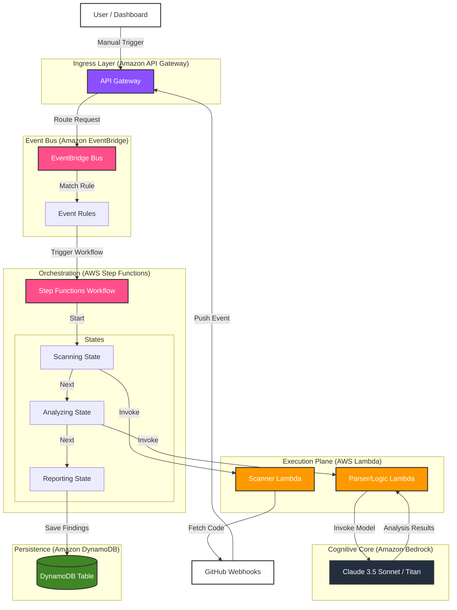

# Oreva AWS Implementation Flowchart

This flowchart illustrates the target **Serverless Architecture** for the Oreva Security Scanner, integrating orchestration, event-driven patterns, and AI.

## Architecture Components

Based on the target architecture plan:

| Component Type | Included AWS Service | Role |
| :--- | :--- | :--- |
| **Ingress** | **Amazon API Gateway** | Secure entry point for the frontend and webhooks to trigger AWS resources. |
| **Event Bus** | **Amazon EventBridge** | Decouples the trigger (Push event/User action) from the action (Start Scan). |
| **Orchestration** | **AWS Step Functions** | Manages the workflow state (Scanning -> Analyzing -> Reporting). |
| **Execution Plane** | **AWS Lambda** | Ephemeral compute for running scans and logic without managing servers. |
| **Cognitive Core** | **Amazon Bedrock** | Accessing Foundation Models (like Claude 3.5 Sonnet) securely within the VPC. |
| **Persistence** | **Amazon DynamoDB** | Storing findings, compliance state, and performing rapid lookups. |
