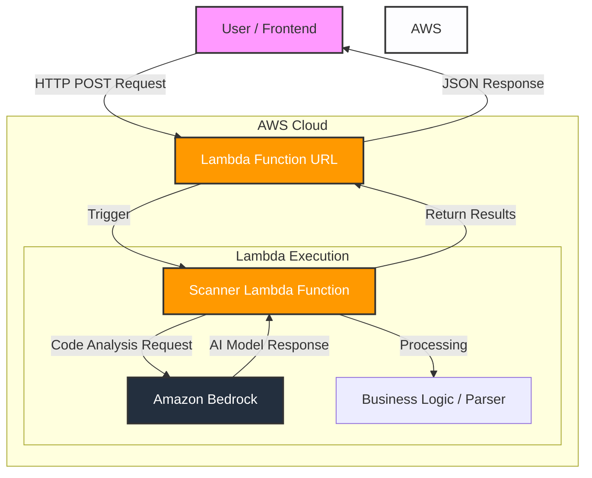

# Oreva AWS Implementation Flowchart

This flowchart illustrates the serverless architecture used for the Oreva Security Scanner.

```mermaid
graph TD
    User[User / Frontend] -->|HTTP POST Request| FnURL[Lambda Function URL]
    
    subgraph AWS Cloud
        FnURL -->|Trigger| Lambda[Scanner Lambda Function]
        
        subgraph Lambda Execution
            Lambda -->|Code Analysis Request| Bedrock[Amazon Bedrock]
            Bedrock -->|AI Model Response| Lambda
            
            Lambda -->|Processing| Logic[Business Logic / Parser]
        end
        
        Lambda -->|Return Results| FnURL
    end
    
    FnURL -->|JSON Response| User
    
    style User fill:#f9f,stroke:#333,stroke-width:2px
    style AWS Cloud fill:#FF9900,stroke:#333,stroke-width:2px,fill-opacity:0.1
    style Lambda fill:#FF9900,stroke:#333,stroke-width:2px,color:white
    style Bedrock fill:#232F3E,stroke:#333,stroke-width:2px,color:white
    style FnURL fill:#FF9900,stroke:#333,stroke-width:2px,color:white
```

## Component Details

1.  **Lambda Function URL**:
    *   Acts as the public entry point for the scanner.
    *   Auth Type: `NONE` (Publicly accessible for dev/demo).
    *   CORS enabled for all origins.

2.  **Scanner Lambda Function**:
    *   Runtime: Node.js 20.x.
    *   Handler: Processes the scan request.
    *   Timeout: 15 minutes (to allow for long-running scans/AI processing).
    *   Memory: 1024 MB.
    *   Role: Has `bedrock:InvokeModel` permissions.

3.  **Amazon Bedrock**:
    *   Foundation Model service used for AI-powered code analysis and vulnerability detection.
